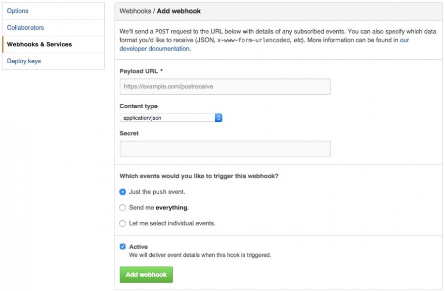

# 使用Github的Webhooks进行网站的自动化部署

使用mWeb做自己的博客，服务器没有直接使用github的gh-pages功能，而是部署到了自己的服务器上。
从此更新博客变成了三步走：1. 使用mWeb生成静态网页 2. push 到github 3. 登录服务器拉取最新内容。

昨天想到，能不能再简化一些步骤，让我的文章push到github后，让服务器自动拉取文章，部署新内容。说干就干，实施想法。

## 1. 目标
服务器自动拉取push到github上的新文章。

## 2. 想法
想法一: 定时检查置顶repo的提交，有更新，则启动部署流程。（主动查询方式）
想法二: github是否支持事件提醒或者第三方有无支持。(被动唤醒方式)(相当于消息推送)

## 3. 思考
主动查询，耗费cpu时间及流量，并且必然会和github产生同步间隔。
被动唤醒，不会消耗不必要的资源，若是支持必然是第一选项。

## 4. 查阅资料(可行性分析)
github支持Webhooks及大量的第三方服务，可以很好得对repo的push等操作做出反应。

**Webhooks做了什么?**
当github收到repo的操作行为时，会向指定的url发送一个带有描述操作内容的post请求。

## 5. 实现思路(总结)
对指定repo注册webhooks，指向我的服务器上的接口，服务器解析数据，若操作是push，则进行部署行为。

## 6. 实现
#### 6.1 部署脚本：
**deploy.sh**

```
#!/bin/bash

LOG_FILE="/var/log/blog_deploy.log"

date >> "$LOG_FILE"
echo "Start deployment" >>"$LOG_FILE"
cd /Path/need/be/deployed/
echo "pulling source code..." >> "$LOG_FILE"
git checkout origin gh-pages
git pull origin gh-pages
echo "Finished." >>"$LOG_FILE"
echo >> $LOG_FILE
```

每当接收到带push的post请求时，执行上面的脚本。

#### 6.2 处理post请求
注：以下nodejs内容摘自[曾曦前辈博客－尘埃落定](http://www.lovelucy.info/auto-deploy-website-by-webhooks-of-github-and-gitlab.html)

> 然后我们就要写一个脚本在 http://dev.lovelucy.info/incoming 这里接受 POST 请求了。因为本人机器上跑的是 node，俺就找了个 nodejs 的中间件 github-webhook-handler 。如果你要部署的是 PHP 网站，那你应该找一个世界上最好的语言 PHP 的版本，或者自己写一个，只需要接收 $_POST 嘛，好简单的，不多废话啦。么么哒 ( • ̀ω•́ )

```
$ npm install -g github-webhook-handler
```
>鉴于在天朝的服务器上 npm 拉 repo 比拉屎还难的状况，我们可以 选用 阿里的镜像，据说 10 分钟和官方同步一次。_(:3 」∠ )_


```
$ npm install -g cnpm --registry=http://r.cnpmjs.org
$ cnpm install -g github-webhook-handler
```
> 好了，万事俱备，下面是 NodeJS 的监听程序 deploy.js

```
var http = require('http')
var createHandler = require('github-webhook-handler')
var handler = createHandler({ path: '/incoming', secret: 'myHashSecret' }) 
// 上面的 secret 保持和 GitHub 后台设置的一致
 
function run_cmd(cmd, args, callback) {
  var spawn = require('child_process').spawn;
  var child = spawn(cmd, args);
  var resp = "";
 
  child.stdout.on('data', function(buffer) { resp += buffer.toString(); });
  child.stdout.on('end', function() { callback (resp) });
}
 
http.createServer(function (req, res) {
  handler(req, res, function (err) {
    res.statusCode = 404
    res.end('no such location')
  })
}).listen(7777)
 
handler.on('error', function (err) {
  console.error('Error:', err.message)
})
 
handler.on('push', function (event) {
  console.log('Received a push event for %s to %s',
    event.payload.repository.name,
    event.payload.ref);
  run_cmd('sh', ['./deploy.sh'], function(text){ console.log(text) });
})
 
/*
handler.on('issues', function (event) {
  console.log('Received an issue event for % action=%s: #%d %s',
    event.payload.repository.name,
    event.payload.action,
    event.payload.issue.number,
    event.payload.issue.title)
})
*/
```
之后把服务器跑起来就可以了。

```
$ nodejs deploy.js
```
为了防止服务挂掉，我们有很多方式可以处理。我选择了用系统自带的nohup。

```
$ nohup nodejs deply.js &
```
曾曦前辈使用的是 NodeJs的forever，也可以使用python的supervisor。
[曾曦前辈博客－尘埃落定](http://www.lovelucy.info/auto-deploy-website-by-webhooks-of-github-and-gitlab.html)有相关介绍。

#### 6.3 配置Webhooks监听
将Payload URL指向自己服务器的接口


```
var handler = createHandler({ path: '/incoming', secret: 'myHashSecret' })

http.createServer(function (req, res) {
  handler(req, res, function (err) {
    res.statusCode = 404
    res.end('no such location')
  })
}).listen(7777)
```
这是deploy.js 的关键代码。
listen(7777)，表明服务器监听的是7777端口
path:'/incoming'，表示在 ip:7777/incoming 接收POST请求
secret: 'myHashSecret', 要求和上图的Secret字段一样，不然服务器会因为不匹配，拒绝接收到的请求。主要为了防止第三方向这个端口发送请求。

## 7. 最后梳理一下
**6.3 那里知道什么时候有人提交文章了，然后告诉6.2 有人push**
**6.2 从6.3 得到消息，看下你的密码(secret)和我的一样不，如果一样，我就把这个消息告诉6.1**
**6.1 开始跑到github数据库拉取最新的数据，部署完成**

## 澄清
有朋友告诉我，复制粘贴的部分比较多。即便加了转载说明，也不是很好。
在这里澄清一下：
网络上技术文章特点：**多**，**杂**，**全**
可用的经典实例: **少**
自生产实例的成本: **费时**
一篇**全原创**的优质文章需要：**思考**＋**原创实例**＋**码字**＋**重复前三项** 。
而对于学习者而言，**思想＋实例＋思路**已经满足80%。
所以我认为，一篇能学到东西的技术文章，并不需要**全原创**。
清晰的思路＋前人提供的经典实例＋个人思考，传达到位即可。

**前人都总结好了，你再发一遍，不是制造网络垃圾吗？**
打造一个以思路清晰著称的博客，专注于技术文章整理、重成文是本博客存在的意义。我不是垃圾的生产者，我是大自然的清道夫。

欢迎关注个人微博[斯科特安的时间 ](http://weibo.com/u/6300854978)，进行技术、非技术交流。


